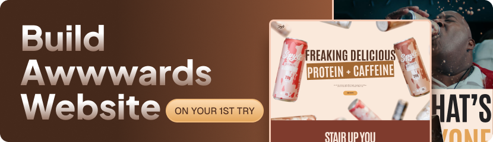

<div align="center">
  

  <br />
  <br />

  
  
  
</div>

# GSAP Awwwards Coffee Website

A premium motion-driven coffee landing page built with React, GSAP, and Tailwind CSS. The site is designed to feel cinematic, responsive, and polished, with scroll-based storytelling, animated text, pinned media, and interactive sections.

## About The Project

This repository demonstrates how to build an Awwwards-style experience in React without overcomplicating the architecture. The interface focuses on strong typography, rich visuals, and GSAP-powered animation patterns such as split text reveals, pinned sections, horizontal motion, and clip-path transitions.

## Tech Stack

- React 19
- Vite
- Tailwind CSS v4
- GSAP 3
- @gsap/react
- react-responsive

## Key Highlights

- Cinematic hero section with responsive image and video fallbacks
- Scroll-triggered text reveal and parallax-like motion
- Horizontal flavor showcase with desktop pinning
- Nutrition section with responsive content rendering
- Benefit section with reusable animated title blocks
- Pinned video reveal with circular clip-path animation
- Testimonial cards with hover-to-play video interaction
- Responsive footer with newsletter UI and social links


### Requirements

- Node.js 18+
- npm, yarn, or pnpm

### Install Dependencies

```bash
npm install
```

### Run Development Server

```bash
npm run dev
```

### Create Production Build

```bash
npm run build
```

### Preview Production Build

```bash
npm run preview
```

## How It Works

- `src/main.jsx` mounts the React application.
- `src/App.jsx` registers GSAP plugins and enables `ScrollSmoother`.
- `src/sections` contains the full page flow in the correct visual order.
- `src/components` holds reusable animation blocks and media wrappers.
- `src/constants/index.js` keeps the page content data-driven.
- `src/index.css` defines the custom theme, layout primitives, and section styles.

## Content Data

The UI is powered by reusable content arrays instead of hardcoded repetition:

- `flavorlists` drives the flavor slider cards
- `nutrientLists` drives the nutrition facts row
- `cards` drives the testimonial video cards

This makes the project easier to maintain and update without changing the component logic.

## Notes

- All images, fonts, and videos are stored in the `public/` directory.
- The experience relies on JavaScript and GSAP animations for the intended presentation.
- Several sections use desktop-first motion patterns with mobile-specific fallbacks.

